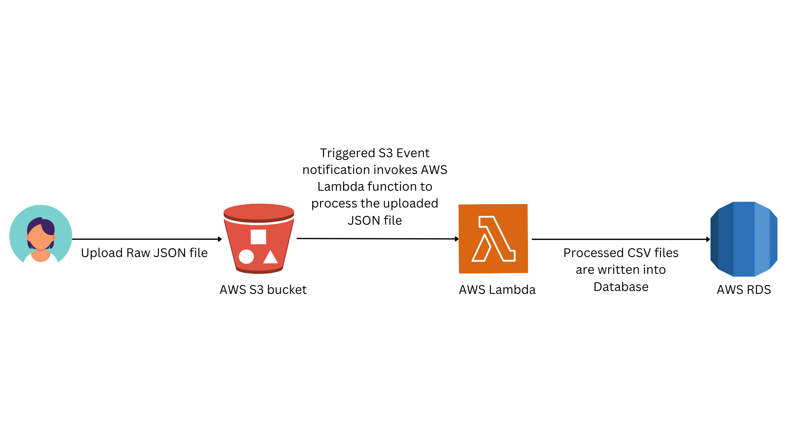

# README

## Instructions on How to Run the Source Code Locally

### 1. **Dependencies**:
Before running, ensure the following are installed:
- **Python 3**
- **pandas**: Run `pip install pandas`
- **xlrd**: Run `pip install xlrd` (Required for reading Excel files with pandas)

### 2. **Clone the Repository**:
\```bash
git clone https://github.com/WXUXIN/Data-Engineer-Internship-Tech-Test-.git
cd Data-Engineer-Internship-Tech-Test-
\```

### 3. **Place Data Files in Directory**:
Ensure `restaurant_data.json` and `Country-Code.xlsx` are in the main directory. Adjust paths in the code if placed differently.

### 4. **Run the Code**:
\```bash
python govtech.py
\```

## Cloud Deployment and Design
### **Design & Deployment:**

I will use three main AWS services: Amazon S3, AWS Lambda, and Amazon RDS. I will store both the raw and processed data in Amazon S3 because it's reliable and easy to work with. When a new file is uploaded to S3, AWS Lambda automatically processes it due to a set trigger. This setup is both scalable and cost-effective, as I only pay for the time Lambda runs. After processing, the data goes into Amazon RDS, which is a database service made for easy data access.

To set this up, I will first first create an S3 bucket to hold the raw data and set it to notify Lambda when new data comes in. Next, I will set up AWS Lambda, making sure it can access both S3 and RDS. After I've set the rules for how Lambda should process the data, I will create an RDS database and make sure Lambda can save data to it. 

In summary, the whole process starts when I upload data to S3, which then gets processed by Lambda to produce the intended CSV files, and they are finally stored in RDS for future access.


### **Decisions & Considerations:**

I chose AWS Lambda because it works automatically when data is added to S3. This approach is simple, scales as needed, and is cost-effective since you only pay for what you use. For the kind of data we have, Lambda is a good choice.

For storing our data, we picked Amazon RDS because the data is organized and RDS is made for that kind of data. RDS is easy to scale, flexible, and secure. It makes sure the data is saved in a way that's easy to access later. It also has features like automatic backups and strong security.

With AWS Lambda's built-in error checks and S3's notifications, I can quickly know if something goes wrong, keeping our data safe.

Thinking about the future, both Lambda and RDS can handle more work if needed,keeping things running smoothly when there are more data or more requests.

Cost is also an important factor to consider. By using services like Lambda, I only pay for what I actually use, which saves money in the long run.

In short, my setup is made to handle the restaurant data in a reliable, scalable, and cost-effective way, showing how using cloud services can make data tasks easier.

## Architecture diagram:



## Test Script Summary
Overall, the testing.py script tests how the data processing script, govtech.py handles various edge cases:

1. Empty JSON file
2. JSON file containing restaraunts with invalid country codes that are not found in the provided Country-Code.xlsx file
3. Empty Photo URL, where the photo_url of a even's photo is not present

and ensures that the data processing behaves as expected for these cases.

Setup:

Before each test, the script sets up some prerequisites, including file paths to specific JSON files:

1. empty_restaurant_data.json for the test involving an empty JSON.
2. invalid_country_code.json for the test checking invalid country codes.
3. empty_photo_url.json for the test verifying the behavior with empty photo URLs.

---

## **Test Cases:**

---

#### **1. `test_empty_json`**

- **Purpose**: 
  - This test ensures the system's resilience when encountering an empty JSON dataset.

- **Expected Outcome**:
  - The `process_data` function should raise an exception when given an empty JSON. This is to ensure the function doesn't process invalid or empty datasets, which could lead to unexpected behaviors or errors later on.

---

#### **2. `test_invalid_country_code`**

- **Purpose**: 
  - Evaluates how the function handles restaurants with country codes not present in a predefined list or excel sheet.

- **Execution**:
  - The `warnings` module captures any warnings thrown during the processing of the dataset.
  - The test asserts that a warning has been issued.

- **Expected Outcome**:
  - A warning should be raised by the `process_data` function when it encounters an invalid country code.
  - The warning message should specifically state: "Invalid country code detected!" to ensure clear communication of the issue.
  - This allows for graceful degradation; rather than stopping the entire process due to a single entry's invalid country code, the function sends a warning and continues processing.

---

#### **3. `test_empty_photo_url`**

- **Purpose**: 
  - Ensures that restaurants with missing photo URLs are handled correctly.

- **Execution**:
  - The function processes the dataset.
  - The resultant CSV is read to verify how empty photo URLs have been processed.

- **Expected Outcome**:
  - Restaurants with missing photo URLs should be included in the output CSV, demonstrating the function's resilience against incomplete data.
  - Specifically, there should be 9 such restaurants. This ensures that missing data points aren't simply dropped but are instead filled in (e.g., with 'NA') and retained.

---
